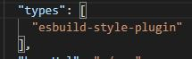

# esbuild-style-plugin

Another esbuild plugin for your styling.

- Supports multiple preprocessors like SASS, STYLUS, LESS
- Dynamic preprocessors import - no preprocessors installed by default
- Handles css modules automatically with PostCSS
- You can include postcss plugins (autoprefixer, preset-env)
- Can read `postcss.config.js` config file - if path is provided in `postcssConfigFile` option
- Support postcss/tailwindcss dependencies for watching files - <https://github.com/postcss/postcss/blob/main/docs/guidelines/plugin.md#3-dependencies>
- SSR / Server side rendering friendly :)
- Includes d.ts files in dist
- Build format for both cjs and esm
- Support esbuild watch
- Written in Typescript with maintainable code

## NPM package

`npm i -D esbuild-style-plugin`

## Using the package

Look at the test files or here is a basic example

```ts
import stylePlugin from 'esbuild-style-plugin'
//const stylePlugin = require('esbuild-style-plugin')

esbuild.build({
  plugins: [
    stylePlugin()
  ]
})
```

### Plugin options

- `extract` default to true
- `cssModulesMatch` match `.module.` by default
- `cssModulesOptions` <https://github.com/madyankin/postcss-modules#usage>
- `renderOptions`
  - `sassOptions` <https://sass-lang.com/documentation/js-api#options>
  - `lessOptions` <https://lesscss.org/usage/#less-options>
  - `stylusOptions` <https://stylus-lang.com/docs/js.html>
- `postcss`
  - `plugins` array of postcss accepted plugins
  - `parser` | `syntax` parse source css - use with postcss-scss
- `postcssConfigFile` absolute path to `postcss.config.js` or `true` for using root folder path

## Preprocessor

The plugin does not come with all preprocessor installed since you might not need all of them.

Install the ones you need!

- SASS `npm i -D sass`
- LESS `npm i -D less`
- STYLUS `npm i -D stylus`

## CSS Modules

### Server side rendering

A specific use case that this plugin covers is SSR.
Using `extract: false` will not process css on server side but will keep css mapping for css modules.

## PostCSS

The plugin is using PostCSS to handle css modules files.
You can include any other plugins with the `postcss` option.

### CSSNano

Do not use cssnano plugin. It won't work and if it did it minifies all files seperatly (slow not efficient).
Just let esbuild minify and do his job.

### Preprocessors import typings

If you want to be able to use `import styles from 'styles.module.sass'` without any errors
Just add `esbuild-style-plugin` to your types in `tsconfig.json`


